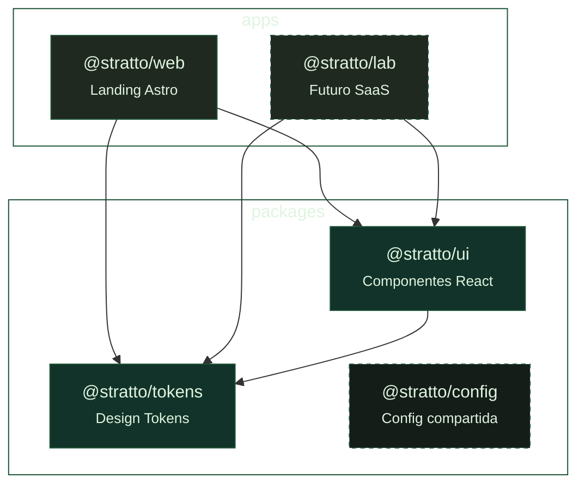

<p align="center">
  
</p>

<p align="center">
  <b>Laboratorio de tecnología, desarrollo de software y diseño de interfaces.</b>
</p>

<p align="center">
  <a href="https://astro.build"></a>
  <a href="https://react.dev"></a>
  <a href="https://tailwindcss.com"></a>
  <a href="https://turbo.build"></a>
  <a href="https://pnpm.io"></a>
  <a href="https://vercel.com"></a>
  <a href="https://webgl2fundamentals.org"></a>
</p>

---

## Stack

| Capa | Tecnología |
|------|------------|
|  | **Astro 5** — islas de React 18 + View Transitions |
|  | **Turborepo 2** — pnpm workspaces 9 |
|  | **Tailwind CSS v4** — `@theme` en CSS nativo |
|  | **shadcn/ui** — Base UI (New York) |
|  | **Motion 11** + View Transitions + GSAP |
|  | **Lilex** + **Cascadia Code** (Fontsource self-hosted) |
|  | **WebGL2** — GLSL fluid background interactivo |
|  | **Vercel** — `@astrojs/vercel` |

---

## Arquitectura



Cada paquete es un workspace independiente versionado, consumido por las apps como dependencias locales via `workspace:*`.

---

## Design System

### Paleta Ancla

<table>
  <tr>
    <td width="120"><b>Terminal Black</b></td>
    <td width="80"><code>#202920</code></td>
    <td width="60"><code>--color-terminal-black</code></td>
    <td width="100"></td>
  </tr>
  <tr>
    <td><b>Pixel Clean</b></td>
    <td><code>#dff4e0</code></td>
    <td><code>--color-pixel-clean</code></td>
    <td></td>
  </tr>
  <tr>
    <td><b>Syntax Lime</b></td>
    <td><code>oklch(93.1% 0.228 122.9)</code></td>
    <td><code>--color-syntax-lime</code></td>
    <td></td>
  </tr>
</table>

### Paleta Fluid Background

<table>
  <tr>
    <td width="120"><b>Deep Base</b></td>
    <td width="80"><code>#202920</code></td>
    <td><code>color1</code></td>
    <td></td>
    <td rowspan="4" align="center">
      <span style="display:inline-block;padding:8px 16px;border-radius:6px;background:linear-gradient(135deg,#202920,#123329,#1D5336);color:#dff4e0;font-size:13px;font-weight:600;border:1px solid rgba(255,255,255,0.1)">fluido<br>orgánico</span>
    </td>
  </tr>
  <tr>
    <td><b>Forest</b></td>
    <td><code>#123329</code></td>
    <td><code>color2</code></td>
    <td></td>
  </tr>
  <tr>
    <td><b>Accent</b></td>
    <td><code>#1D5336</code></td>
    <td><code>color3</code></td>
    <td></td>
  </tr>
  <tr>
    <td><b>Deepest</b></td>
    <td><code>#141D18</code></td>
    <td>—</td>
    <td></td>
  </tr>
</table>

### Mapeo Semántico

| Variable | Token |
|----------|-------|
| `--color-bg` |  Terminal Black |
| `--color-bg-inverse` |  Pixel Clean |
| `--color-fg` |  Pixel Clean |
| `--color-fg-inverse` |  Terminal Black |
| `--color-accent` |  Syntax Lime |

Las escalas de grises y verdes se completan con la paleta nativa `neutral-*` y `lime-*` de Tailwind v4 (~123° hue).

---

## Fluid Background

El componente <code>FluidBackground</code> renderiza un shader **WebGL2 con GLSL** que genera patrones fluidos orgánicos mediante domain warping, con capas de ruido FBM, modulación plasma, granulado y puntos de luz interactivos.

```
                          ┌──────────────┐
        Noise Scale ─────→│   FBM × 5    │
                          │ Domain Warp  │────→ f
        Mouse ───────────→│  (q → r → f) │
                          └──────────────┘
                          ┌──────────────┐
        Plasma ──────────→│  Modulation  │────→ mix(f, plasma, 0.1)
                          └──────────────┘
                          ┌──────────────┐
        Grain ───────────→│  Film Grain  │────→ col += grain
                          └──────────────┘
                          ┌──────────────┐
        Point ───────────→│   Particles  │────→ col = mix(col, pointCol)
                          └──────────────┘

        Color1 ─── #202920 ──┐
        Color2 ─── #123329 ──┤──→ mix → col
        Color3 ─── #1D5336 ──┘
```

### Props

| Prop | Default | Descripción |
|------|---------|-------------|
| <code>color1</code> |  `#202920` | Base oscura |
| <code>color2</code> |  `#123329` | Tono medio |
| <code>color3</code> |  `#1D5336` | Acento |
| <code>opacity</code> | `0.5` | Opacidad del efecto |
| <code>speed</code> | `0.10` | Velocidad de flujo |
| <code>noiseScale</code> | `1.4` | Escala del ruido |
| <code>grainFilm</code> | `0.071` | Intensidad de granulado |
| <code>pointerEffect</code> | `true` | Interacción con el mouse |

---

## Componentes

Todos los componentes están en <code>packages/ui/src/</code> y se exportan desde <code>@stratto/ui</code>.

Para agregar componentes de shadcn/ui:

```bash
cd apps/web
pnpm dlx shadcn@latest add button card dialog
```

Se registran automáticamente en <code>packages/ui/src/</code> y se re-exportan.

---

## Primeros pasos

```bash
# Clonar e instalar
git clone https://github.com/rodfuentealba/stratto.git
cd stratto
pnpm install

# Desarrollo
pnpm web          # apps/web → http://localhost:4321
pnpm dev          # turbo corre todas las apps en paralelo

# Build & Lint
pnpm build
pnpm lint
pnpm format
```

## Scripts

| Comando | Descripción |
|---------|-------------|
| `pnpm dev` | Turbo: todas las apps en dev |
| `pnpm web` | Solo <code>apps/web</code> con Astro |
| `pnpm build` | Build completo |
| `pnpm lint` | Type-check con <code>astro check</code> |
| `pnpm format` | Prettier |

## Estructura

```
apps/web/src/
├── layouts/
│   └── Layout.astro          Layout base (head, fonts, body)
├── pages/
│   └── index.astro           Landing page con typewriter
└── styles/
    └── global.css            Tailwind v4 + @theme

packages/
├── tokens/
│   └── tokens.css            CSS custom properties (paleta)
├── ui/src/
│   ├── index.ts              Export público
│   └── fluid-background.tsx  Shader WebGL2 con GLSL
└── config/                   (reservado)
```

---

<p align="center">
  <sub>Hecho con </sub>
  <a href="https://astro.build"></a>
  <a href="https://react.dev"></a>
  <a href="https://tailwindcss.com"></a>
  <a href="https://turbo.build"></a>
  <sub> · STRATTO 2026</sub>
</p>
