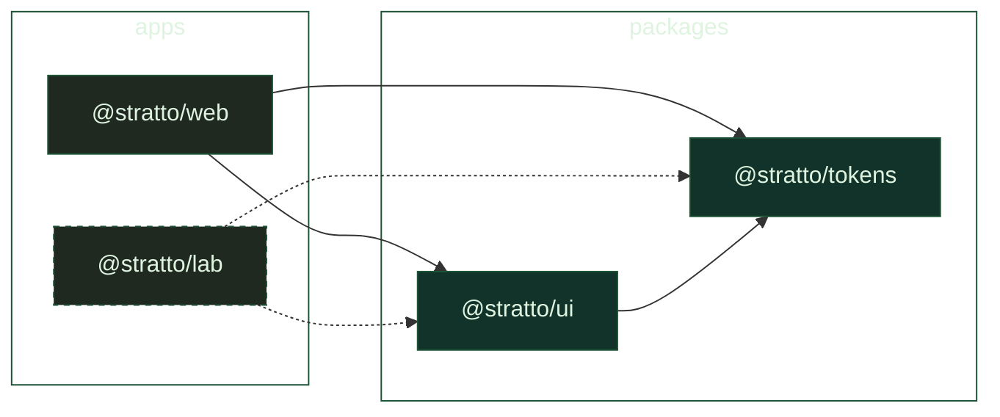

<p align="center">
  
</p>

<p align="center">
  <b>Laboratorio de tecnología, desarrollo de software y diseño de interfaces.</b>
</p>

<p align="center">
  <a href="https://astro.build"></a>
  <a href="https://react.dev"></a>
  <a href="https://tailwindcss.com"></a>
  <a href="https://turbo.build"></a>
  <a href="https://pnpm.io"></a>
  <a href="https://vercel.com"></a>
</p>

---

## Stack

| Capa | Tecnología |
|------|------------|
|  | **Astro 5** + islas de React 18 |
|  | **Turborepo 2** · pnpm workspaces 9 |
|  | **Tailwind CSS v4** · configuración CSS nativa |
|  | **shadcn/ui** sobre Base UI (New York) |
|  | **Motion 11** + View Transitions + GSAP |
|  | **Lilex** + **Cascadia Code** (self-hosted) |
|  | **WebGL2** · fluid background interactivo |
|  | **Vercel** via `@astrojs/vercel` |

---

## Arquitectura



```
stratto/
├── apps/
│   └── web/            Landing pública (@stratto/web)
├── packages/
│   ├── tokens/         Design tokens (@stratto/tokens)
│   └── ui/             Componentes React (@stratto/ui)
```

Cada paquete es workspace independiente, consumido por las apps via `workspace:*`.

---

## Design System

### Paleta Ancla

<table>
  <tr>
    <td width="110"><b>Terminal Black</b></td>
    <td width="70"><code>#202920</code></td>
    <td width="100"></td>
    <td><code>--color-terminal-black</code></td>
  </tr>
  <tr>
    <td><b>Pixel Clean</b></td>
    <td><code>#dff4e0</code></td>
    <td></td>
    <td><code>--color-pixel-clean</code></td>
  </tr>
  <tr>
    <td><b>Syntax Lime</b></td>
    <td><code>oklch(93.1% 0.228 122.9)</code></td>
    <td></td>
    <td><code>--color-syntax-lime</code></td>
  </tr>
</table>

### Mapeo Semántico

| Variable | Token |
|----------|-------|
| `--color-bg` |  Terminal Black |
| `--color-bg-inverse` |  Pixel Clean |
| `--color-fg` |  Pixel Clean |
| `--color-fg-inverse` |  Terminal Black |
| `--color-accent` |  Syntax Lime |

Grises y verdes complementarios via `neutral-*` y `lime-*` de Tailwind v4.

---

## Primeros pasos

```bash
git clone https://github.com/rodfuentealba/stratto.git
cd stratto
pnpm install
pnpm web        # http://localhost:4321
pnpm build      # build completo
pnpm lint       # type-check
pnpm format     # prettier
```

## Scripts

| Comando | Descripción |
|---------|-------------|
| `pnpm dev` | Turbo: todas las apps |
| `pnpm web` | Solo apps/web |
| `pnpm build` | Build completo |
| `pnpm lint` | Type-check |
| `pnpm format` | Prettier |

---

<p align="center">
  <sub>Hecho con </sub>
  <a href="https://astro.build"></a>
  <a href="https://react.dev"></a>
  <a href="https://tailwindcss.com"></a>
  <a href="https://turbo.build"></a>
  <sub> · STRATTO 2026</sub>
</p>
